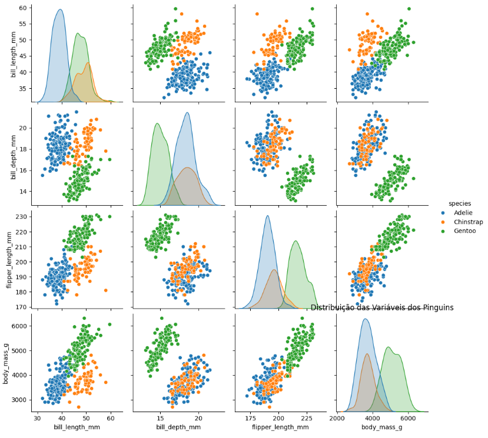
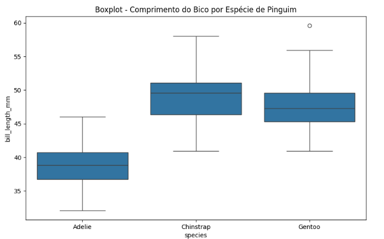
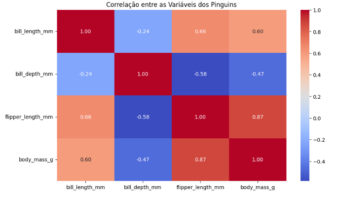
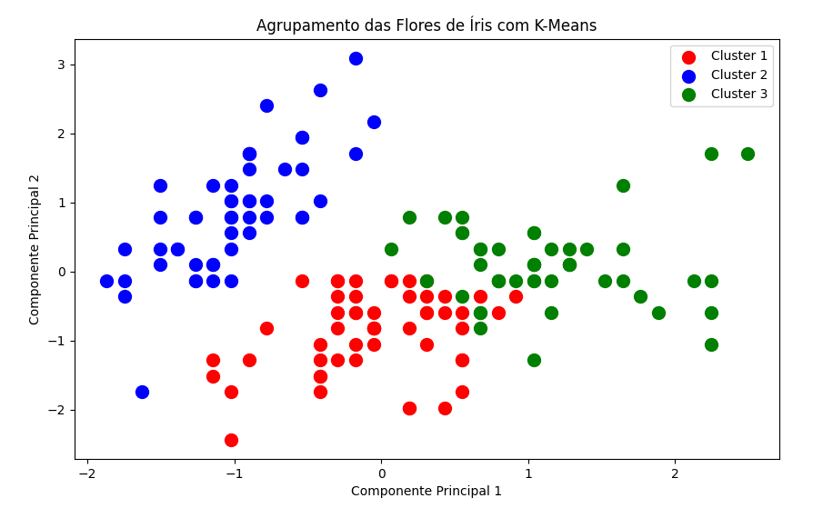
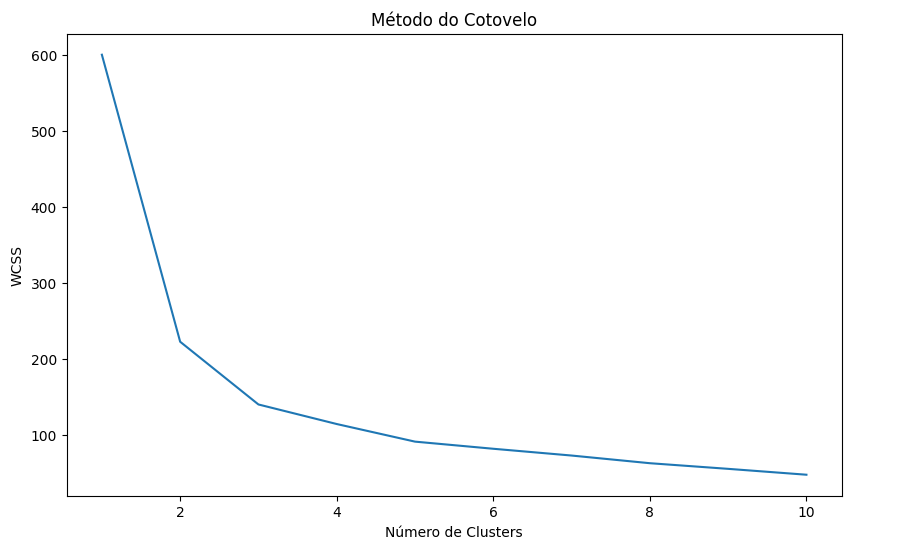

# **Projeto de Machine Learning com Pinguins e Flores de Íris**

Este projeto aplica técnicas de aprendizado de máquina para analisar e modelar dois conjuntos de dados biológicos: a base de dados dos **pinguins** e a base de dados das **flores de íris**. O objetivo é realizar uma análise exploratória de dados (EDA), construir modelos de predição e classificação, e avaliar os resultados obtidos.

## **Objetivos do Projeto**

- **Análise Exploratória de Dados (EDA)**: Compreender as distribuições das variáveis e suas relações no contexto biológico.
- **Modelagem de Machine Learning**:
  - **Regressão Linear**: Prever o peso dos pinguins com base nas suas características físicas.
  - **Árvore de Decisão**: Classificar os pinguins em suas respectivas espécies.
  - **K-Means**: Agrupar flores de íris com base em suas características físicas.
- **Avaliação de Modelos**: Medir a performance dos modelos utilizando métricas como RMSE, Acurácia e o Método do Cotovelo.

## **Bases de Dados Utilizadas**

1. **Pinguins**: Base de dados contendo informações sobre várias espécies de pinguins, incluindo o comprimento do bico, profundidade do bico, tamanho da nadadeira, espécie e sexo.
2. **Íris**: Base de dados com informações sobre as características físicas de flores do gênero Iris, como comprimento e largura da sépala e da pétala.

As bases de dados foram obtidas diretamente da biblioteca **Seaborn**, uma biblioteca popular de visualização de dados em Python.

## **Análise Exploratória de Dados (EDA)**

### Gráficos e Análises:

1. **Pairplot dos Pinguins**:
   - Um gráfico de dispersão que mostra a relação entre as variáveis físicas dos pinguins e a espécie.
   
 

2. **Boxplot do Comprimento do Bico por Espécie**:
   - Mostra a distribuição do comprimento do bico para cada espécie de pinguim, incluindo a mediana e possíveis outliers.

  

3. **Heatmap de Correlação**:
   - Visualiza a correlação entre as variáveis numéricas dos pinguins, destacando a relação entre o comprimento do bico e o peso.

 

## **Pré-processamento dos Dados**

- **Tratamento de Dados Faltantes**: Remoção de registros com valores ausentes.
- **Padronização das Variáveis Numéricas**: Aplicação de z-score para garantir que as variáveis numéricas tenham a mesma escala.
- **Transformação de Variáveis Categóricas**: Conversão das variáveis `species` e `sex` para formato numérico para facilitar o treinamento dos modelos.

## **Modelos de Machine Learning**

1. **Regressão Linear**:
   - Utilizada para prever o peso dos pinguins com base em suas características físicas. O modelo obteve um **RMSE de 296g**, o que representa uma precisão razoável nas previsões.

2. **Árvore de Decisão**:
   - Utilizada para classificar os pinguins em suas respectivas espécies. O modelo obteve uma **acurácia de 96%**, o que demonstra sua boa performance.

3. **K-Means**:
   - Utilizado para agrupar flores de íris em clusters com base em suas características físicas. Através do **Método do Cotovelo**, determinamos que o número ideal de clusters para este conjunto de dados é 3.

  
  

## **Resultados e Conclusões**

- O modelo de **regressão linear** foi eficaz para prever o peso dos pinguins, com um erro médio de 296g.
- A **árvore de decisão** teve uma excelente performance, alcançando uma **acurácia de 96%** na classificação das espécies de pinguins.
- O modelo de **K-Means** identificou corretamente os 3 clusters de flores de íris, ajudando a segmentar as flores com base nas suas características físicas.

Esses modelos podem ser aplicados em projetos reais para prever características físicas de animais ou para agrupar espécies com base em dados observacionais.

## **Instalação e Execução**

Para executar este projeto em seu próprio ambiente, siga as instruções abaixo:

### Requisitos:

- Python 3.x
- Bibliotecas:
  - `seaborn`
  - `pandas`
  - `matplotlib`
  - `numpy`
  - `scikit-learn`

### Como Executar:

1. Clone este repositório:

   ```bash
   git clone https://github.com/seu-usuario/projeto-ebac-pinguins-flores.git
